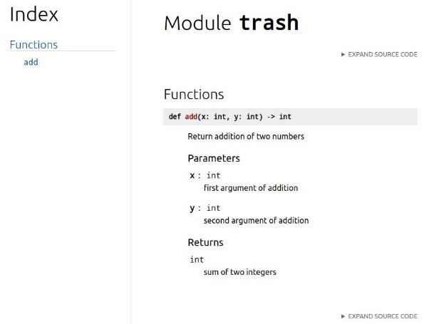
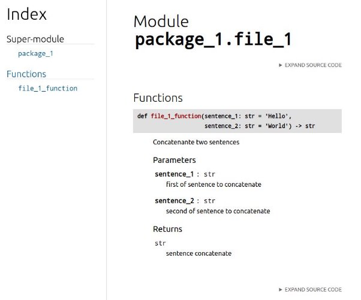
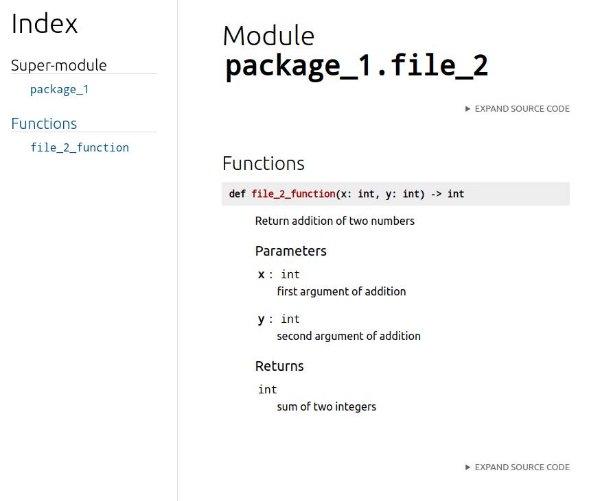

# Introduction

L’objectif de ce cours est de vous apprendre à coder comme un professionnel, quand on code, on doit s’assurer que notre code ne génère pas de dette technique.

La dette technique en informatique est un terme pour décrire les problèmes qui s'accumulent avec le temps dans un système informatique. Ce sont des tâches telles que la correction de bugs, l'optimisation du code, la mise à jour de la sécurité, etc. qui ont été ignorées ou reportées.

À long terme, cette dette technique peut paralyser voir annulé un projet si elle est mal géré. Il y aura toujours de la dette technique et coder un code parfait est impossible, mais on peut coder de manière acceptable pour la contrôler

## Setting de VScode

chaque éditeur à ces caractéristique propre et bien maitrisé, il peut considérablement augmenter votre productivité.

Nous avons choisi Vscode parce qu’il est beaucoup utilisé dans l’industrie et vous aurez de grandes chances de devoir coder avec si on vous l’impose, un second bon choix est Pycharm qui est très centré sur le développement de python, mais si votre code utilise d’autres langages que python cet avantage deviendra son principal défaut.

Une configuration que nous vous conseillons dans tout vos projet Vscode est [celle-ci](https://github.com/JonathanNdambaPro/S.E/blob/main/.vscode/setting.json) :

```json
{
    "editor.defaultFormatter": "esbenp.prettier-vscode",
    "[python]": {
      "editor.defaultFormatter": null
    },
    "editor.formatOnSaveMode": "file",
    "editor.formatOnSave": true,
    "editor.codeActionsOnSave": {
      "source.organizeImports": true
    },
    "python.linting.pylintEnabled": true,
    "python.linting.mypyEnabled": true,
    "python.linting.enabled": true,
    "python.formatting.provider": "black",
    "vim.smartRelativeLine": true
}
```

- "editor.formatOnSaveMode": "file" : définit que vous souhaité sauvegarder vos fichier automatiquement
- "editor.formatOnSave": true”: Active la sauvegarde automatique
- "editor.codeActionsOnSave": { "source.organizeImports": true} : Permet d’organiser vos importation automatiquement pour rendre votre code plus propre
- "python.linting.pylintEnabled": true permet d’activer un linter qui vous guidera quand vous développerez, il vous conseillera les manière de rendre votre code le plus propre possible
- "python.linting.enabled": true: active le linter
- "python.analysis.typeCheckingMode": "strict" permert de vérifier le typing dans le code python
- "python.formatting.provider": "black" le formateur qui cleanera votre code pour vous

### .pylintrc

.pylintrc est un fichier de configuration pour Pylint, un outil de vérification de code pour le langage Python. Il permet de définir des règles de codage et des paramètres pour la vérification du code.

[lien du code](https://github.com/JonathanNdambaPro/S.E/blob/main/.pylintrc)

```ini
[BASIC]

# Good variable names which should always be accepted, separated by a comma
good-names=i,j,k,ex,Run,_

# Bad variable names which should always be refused, separated by a comma
bad-names=foo,bar,baz,toto,tutu,tata

# Colon-delimited sets of names that determine each other's naming style when
# the name regexes allow several styles.
name-group=

# Include a hint for the correct naming format with invalid-name
include-naming-hint=no

# List of decorators that produce properties, such as abc.abstractproperty. Add
# to this list to register other decorators that produce valid properties.
property-classes=abc.abstractproperty

# Regular expression matching correct function names
function-rgx=[a-z_][a-z0-9_]{2,30}$

# Naming hint for function names
function-name-hint=[a-z_][a-z0-9_]{2,30}$

# Regular expression matching correct variable names
variable-rgx=[a-z_][a-z0-9_]{2,30}$

# Naming hint for variable names
variable-name-hint=[a-z_][a-z0-9_]{2,30}$

# Regular expression matching correct constant names
const-rgx=(([A-Z_][A-Z0-9_]*)|(__.*__))$

# Naming hint for constant names
const-name-hint=(([A-Z_][A-Z0-9_]*)|(__.*__))$

# Regular expression matching correct attribute names
attr-rgx=[a-z_][a-z0-9_]{2,30}$

# Naming hint for attribute names
attr-name-hint=[a-z_][a-z0-9_]{2,30}$

# Regular expression matching correct argument names
argument-rgx=[a-z_][a-z0-9_]{2,30}$

# Naming hint for argument names
argument-name-hint=[a-z_][a-z0-9_]{2,30}$

# Regular expression matching correct class attribute names
class-attribute-rgx=([A-Za-z_][A-Za-z0-9_]{2,30}|(__.*__))$

# Naming hint for class attribute names
class-attribute-name-hint=([A-Za-z_][A-Za-z0-9_]{2,30}|(__.*__))$

# Regular expression matching correct inline iteration names
inlinevar-rgx=[A-Za-z_][A-Za-z0-9_]*$

# Naming hint for inline iteration names
inlinevar-name-hint=[A-Za-z_][A-Za-z0-9_]*$

# Regular expression matching correct class names
class-rgx=[A-Z_][a-zA-Z0-9]+$

# Naming hint for class names
class-name-hint=[A-Z_][a-zA-Z0-9]+$

# Regular expression matching correct module names
module-rgx=(([a-z_][a-z0-9_]*)|([A-Z][a-zA-Z0-9]+))$

# Naming hint for module names
module-name-hint=(([a-z_][a-z0-9_]*)|([A-Z][a-zA-Z0-9]+))$

# Regular expression matching correct method names
method-rgx=[a-z_][a-z0-9_]{2,30}$

# Naming hint for method names
method-name-hint=[a-z_][a-z0-9_]{2,30}$

# Regular expression which should only match function or class names that do
# not require a docstring.
no-docstring-rgx=^_

# Minimum line length for functions/classes that require docstrings, shorter
# ones are exempt.
docstring-min-length=-1

[ELIF]

# Maximum number of nested blocks for function / method body
max-nested-blocks=5


[DESIGN]

# Maximum number of arguments for function / method
max-args=7

# Argument names that match this expression will be ignored. Default to name
# with leading underscore
ignored-argument-names=_.*

# Maximum number of locals for function / method body
max-locals=15

# Maximum number of return / yield for function / method body
max-returns=6

# Maximum number of branch for function / method body
max-branches=12

# Maximum number of statements in function / method body
max-statements=50

# Maximum number of parents for a class (see R0901).
max-parents=7

# Maximum number of attributes for a class (see R0902).
max-attributes=7

# Minimum number of public methods for a class (see R0903).
min-public-methods=0

# Maximum number of public methods for a class (see R0904).
max-public-methods=20

# Maximum number of boolean expressions in a if statement
max-bool-expr=5
```

Si vous voulez voir des exemple de règle que vous pouvez utiliser aller [ce lien](https://github.com/kubeflow/examples/blob/master/.pylintrc)

### Environnement virtuel


Vous devez mettre en place un environnement virtuel en place.

Quand vous téléchargez un module/package, il a une version qui lui est propre, ces modules sont amenés à évoluer (correction, nouvelle features..) en plus de ça tous ces packages interagissent entre eux. Imaginons que dans un projet 1 vous avez plusieurs package qui fonctionnent correctement entre eux, mais que dans un projet 2 vous avez besoins d’une autre combinaison de package, si vous settez vos package pour que le projet 2 marche alors le projet 1 ne marchera plus et inversement, si on a 100 projets, c'est un véritable enfer.

Un environnement virtuel va nous permettre d’isoler une configuration chaque projet, comme ça nous somme sûr que les configuration propre au projet sont fonctionnels et ne s’impactent pas les uns les autres.

Commande à lancer dans le terminal :
```bash
sudo apt install python3.10-venv # (la version peut être différente entrer python --version ou python3 --version pour connaitre la version)
python3 -m venv .
```

pour activer l’environnement taper : source bin/activate pour sortir de l’environnement taper : deactivate

### Requirements.txt

une fois votre environnement virtuel créé, il faut ensuite setup votre requirements.txt. Imaginons que vous travaillez avec une équipe, vous créez votre environnement virtuel, vous installez votre package et il fonctionne, un de vos collègues voudrait le faire fonctionner sur la machine, dans la majorité des cas, il téléchargera les package que vous lui avez indiqué, mais ils ne marcheront probablement pas, car même s'il a les mêmes packages il y a très peu de chance qu’ils soient à la même version.


Il faut s’assurer que les versions soient les mêmes

```bash
pip list
```


tout rentrer à la main serait trop long, on peut le résoudre avec une seule commande
```bash
pip freeze > requirements.txt
```
et si vous devez installer des package à partir d’un requirements.txt
```bash
pip install -r requirements.txt
```
essayons avec un cas pratique
```bash
python3 -m venv .
source bin/activate
pip install pandas
pip install fastapi
pip freeze > requirements.txt
```


### .pre-commit

Que vous soyez vigilant ou non et même avec toute l’application possible, nous sommes humains, il y aura des moments où vous aurez des oublis et votre code sera moins propre qu’il devrait, il existe des outils qui géreront automatiquement ça pour vous.

### black

black est un formateur qui vous permettra de formater votre code de manière à ce qu’il respecte les conventions.
```bash
pip install git+<https://github.com/psf/black>
touch trash.py
```

Ecrivez dans le fichier trash les commandes suivantes :
```py
def double(x): return x * 2

print(double(5))
```

```bash
black trash.py
```

vous devriez avoir cette sortie : 
```py
def double:
  return x * 2

print(double(5))
```

comme on peut le voir dans le premier exemple, on a mis toutes les instruction sur une ligne ce qui n’est pas conseillé, black l’a corrigé automatiquement.

on peut setup les différentes règles de black dans un .toml

```bash
touch pyproject.toml
```

```toml
[tool.black]
line-length = 128
include = '\.pyi?$'
exclude = '''
/(
    \.git
  | \.hg
  | \.mypy_cache
  | \.tox
  | \.venv
  | _build
  | buck-out
  | build
  | dist
)/
'''
```

### Flake8

flake8 à une fonction similaire à black, mais va plus loin dans la vérifiant de règles plus strict, cependant il ne formatte pas le code, c’est un bon complément à black.

```bash
pip install flake8
```

```py
def double(x):
  if x % 2 == 0: return x * 2
  else: return x*3

print(double(5))
```

```bash
flake8 trash.py
```


comme pour black on peut aussi setup flake avec le fichier .flake8

```bash
touch .flake8
```

```ini
[flake8]
ignore = E203, E266, E501, W503, F403, F401
max-line-length = 128
max-complexity = 18
select = B,C,E,F,W,T4,B9
```

ce setting est celui que nous vous conseillons pour que flake8 ne soit pas trop restrictif.

### isort

isort va servir à organiser de manière cohérente les importation pour respecter les convention python.

```bash
pip install isort
```

```py
import sys, os, pandas, fastapi

def double(x):
  if x % 2 == 0: return x * 2
  else: return x*3

print(double(5))

```

```bash
isort trash.py
```

```py
import sys
import os

import fastapi
import pandas

def double(x):
  if x % 2 == 0: return x * 2
  else: return x*3

print(double(5))
```

on peut également configurer le dans le .toml
```toml
[tool.black]
line-length = 128
include = '\.pyi?$'
exclude = '''
/(
    \.git
  | \.hg
  | \.mypy_cache
  | \.tox
  | \.venv
  | _build
  | buck-out
  | build
  | dist
)/
'''

[tool.isort]
line_length = 79
multi_line_output = 3
include_trailing_comma = true
force_grid_wrap = 0
use_parentheses = true
ensure_newline_before_comments = true
```

.pre-commit

Le problème avec ces commandes, c'est qu’il faut les lancer de manière manuel ce qui amène forcément à des erreurs, de plus si on travaille en équipe, vérifier que tout le monde respecte le processus devient très complexe.

.pre-commit permet de faire en sorte qu'à chaque commit les nouveaux fichiers python soit automatiquement checker et corriger sans que nous ayons à le faire à chaque fois

faire un fichier qui ne respecte pas les conventions : trash.py
```py
import sys, os, pandas, fastapi

def double(x):
  if x % 2 == 0: return x * 2
  else: return x*3

print(double(5))
```

```bash
pip install pre-commit
touch.pre-commit-config.yaml
```

```yml
repos:
-   repo: https://github.com/psf/black
    rev: 22.6.0
    hooks:
    - id: black
      exclude: ^bin/
-   repo: https://github.com/pycqa/flake8
    rev: 3.9.2
    hooks:
    - id: flake8
      exclude: ^bin/
-   repo: https://github.com/pycqa/isort
    rev: 5.5.4
    hooks:
    -   id: isort
        files: "\\.(py)$"
        exclude: ^bin/
- repo: local
  hooks:
  -   id: pdoc
      name: pdoc
      description: 'pdoc: Auto-generate API documentation for Python projects'
      entry: pdoc --html --skip-errors --force --output-dir docs package_1
      language: python
      language_version: python3
      require_serial: true
      types: [python]
```
```bash
pre-commit install
git add .
git commit -m "first precommit"
```


```py
import fastapi
import pandas

def double(x):
  if x % 2 ==0:
    return x * 2
  else:
    return x * 3


print(double(5))
```

### Type Hints

Python est-ce qu’on appelle une langage avec une type dynamique, cela implique qu’on ne peut pas affecter un type à une variable, la variable va prendre une valeur qui elle-même à un type ce qui peut mener à certaine erreur.
```py
some_variable_1 = 5
some_variable_2 = "lol"

def add(x, y):
  return x + y

print(add(some_variable_1, some_variable_2))
```


Dans d’autre langage, on aurait pu explicitement demander que le type des deux variables soit des integers, au lieu que python tente une opération qui ne peut pas marcher.

Mais il peut arriver pire

```py
some_variable_1 = "loli"
some_variable_2 = "lol"

def add(x, y):
  return x + y

print(add(some_variable_1, some_variable_2))
```


Ici l’erreur est beaucoup plus perverse parce que d’un point de vu technique ce n’en est pas une.

L’addition pour les string est une concaténation mais imaginons que nous soyons dans un grand projet et que toutes les autres fonctions qui utilise add s’attendent à une sortie integer, le bug va se disperser partout et il sera beaucoup plus difficile d’en retrouver la cause.

L’une des solution est d’indiquer le type directement dans le code pour que les autres déeloppeurs ne se trompe pas sur les entrées

```py
some_variable_1 = 5
some_variable_2 = 6

def add(x: int, y: int) -> int:
  return x + y

print(add(some_variable_1, some_variable_2))
```
c’est ce qu’on appelle le type hint, ces annotation ne change pas le comportement de python, mais aide grandement les développeurs à se comprendre et savoir dans quelle cas utiliser les fonction

tip : on peut aller plus loin pour les integers et les floats, on s’attend au même type de comportement, mais ici ont exclu les floats alors que conceptuellement ce n’est pas correct de faire ça, on peut contourner cette problématique en utilisant Union.

```py
import typing as t

some_variable_1 = 5
some_variable_2 = 6

def add(x: t.Union[int, float], y: t.Union[int, float]) -> t.Union[int, float]:
  return x + y

print(add(some_variable_1, some_variable_2))
```
Il existe beaucoup de typing disponible pour les besoins que vous rencontrerez vous pouvez les voir [ici](https://docs.python.org/3/library/typing.html)

tip:

garder à l’esprit que vous devez garder à l’esprit plusieurs chose:

- Un types trop complexe peut amener à des bug incompréhensible lors de développement de dataclass (plus tard dans le cours) essayer de garder la structure aussi simple que possible
- Les types peuvent rendre vos fonction trop restrictive, dans notre exemple si nous n’avions pas inclus le float il aurait fallu coder une autre fonction qui fait exactement la même chose pour les floats. Il faut essayer d’être dans un entre deux.

### Docstring

les types hints servent à rendre son code le plus compréhensible possible, mais ce n’est pas suffisant, on utilise le plus souvent ce qu’on appelle un docstring qui permettra de rendre le code le plus lisible possible.

Il existe deux formats grandement utilisés dans la communauté :

- numpy :
  - [Documentation](https://numpydoc.readthedocs.io/en/latest/format.html)
  - [Exemple](https://sphinxcontrib-napoleon.readthedocs.io/en/latest/example_numpy.html)
- Google :
  - [Exemple](https://sphinxcontrib-napoleon.readthedocs.io/en/latest/example_google.html)

Dans notre exemple, nous allons utiliser le format numpy mais rien ne vous empêche dans d’autres projets d’utiliser le format google ou un autre utilisé dans vos nouvelles équipes.

- Quand nous avons une fonction sans argument :
```py
def add():
  """Return addition of two numbers"""
  return 2 + 3
```

- Quand nous avons des arguments

```py
def add(x: int, y: int)-> int:
  """Return addition of two numbers
  
  Parameters
  ----------
  x : int
    first argument of addition

  y : int
    second argument of addition

  Returns
  -------
  int
    addition of x and y
    
  """
  return 2 + 3
```

il existe tous les type de cas dans [exemple](https://sphinxcontrib-napoleon.readthedocs.io/en/latest/example_numpy.html), vous avez juste à les recopier et à les modifier en fonction de votre usecase.

### Pdoc

Grâce à notre pdoc, nous pouvons générer automatiquement un format de documentation à partir de nos docstring

```bash
pip3 install pdoc3
```
```bash
pdoc --html --skip-errors --force --output-dir docs trash.py
```




si nous avons un package et que nous voulons faire une documentation pour tout les package en une fois :


```py
def file_1_function(sentence_1: str = "Hello", sentence_2: str = "World") -> str:
    """Concatenante two sentences

    Parameters
    ----------

    sentence_1: str
        first of sentence to concatenate

    sentence_2: str
        second of sentence to concatenate

    Returns
    -------
    str
        sentence concatenate
    """
    return f"{sentence_1} {sentence_2}"
```

```py
from package_1.file_1 import file_1_function


def file_2_function(x: int, y: int) -> int:
    """Return addition of two numbers

    Parameters
    ----------
    x : int
        first argument of addition
    y: int
        second argument of addition

    Returns
    -------
    int
        sum of two integers
    """
    return x + y
```

```bash
pdoc --html --skip-errors --force --output-dir docs package_1
```






on peut également ajouter pdoc au précommit

```yaml
repos:
-   repo: https://github.com/psf/black
    rev: 22.6.0
    hooks:
    - id: black
      exclude: ^bin/
-   repo: https://github.com/pycqa/flake8
    rev: 3.9.2
    hooks:
    - id: flake8
      exclude: ^bin/
-   repo: https://github.com/pycqa/isort
    rev: 5.5.4
    hooks:
    -   id: isort
        files: "\\.(py)$"
        exclude: ^bin/
- repo: local
  hooks:
  -   id: pdoc
      name: pdoc
      description: 'pdoc: Auto-generate API documentation for Python projects'
      entry: pdoc --html --skip-errors --force --output-dir docs package_1
      language: python
      language_version: python3
      require_serial: true
      types: [python]
```
### Makefile

le Makefile est un moyen de stocker les commande souvent utilisé sans avoir besoin de les retenir par cœur.

Nous allons reprendre l’exemple de pdoc (même si en pratique plus vraiment nécessaire, car mis dans le .pre-commit-config.yaml)

la commande pour générer la documentation est difficile à retenir (si on ajoute toutes les commandes qui s’ajouteront au fur et à mesure que votre code évolue, il devient impossible de toutes les retenir)

nous allons créer un Makefile pour que ça soit plus simple :
 
```bash
touch Makefile
```

```Makefile
docs:
	pdoc --html --skip-errors --force --output-dir docs package_1
```

```bash
make docs
```


La sortie ne correspond pas à ce que nous devrions obtenir, elle devrait ressembler à ça :


c’est parce qu’il y a un dossier qui s’appelle docs le même nom que la commande que nous avons choisie du coup make fait la confusion, pour ne pas tomber dans ce piège on peut utiliser .PHONY:

```Makefile
.PHONY: docs
docs:
	pdoc --html --skip-errors --force --output-dir docs package_1
```

cela va permettre de privilégier la commande de make plutôt que de s’intéresser au dossier

maintenant avec la modification .PHONY: docs en tapant make docs on obtient :


pour toutes les commandes complexes, c'est une bonne idée de mettre toute les commande importante dans le Makefile.

### Organisation des modules/packages

les packages ont une façon de précise de pouvoir intéragir entre eux


tous les packages doivent avoir un \_\_init\_\_.py sinon python ne sera pas en mesure de faire interagir les scripts entre eux.

```py
def file_1_function(sentence_1: str = "Hello", sentence_2: str = "World") -> str:
    """Concatenante two sentences

    Parameters
    ----------

    sentence_1: str
        first of sentence to concatenate

    sentence_2: str
        second of sentence to concatenate

    Returns
    -------
    str
        sentence concatenate
    """
    return f"{sentence_1} {sentence_2}"
```

```py
def file_1_function(sentence_1: str = "Hello", sentence_2: str = "World") -> str:
    """Concatenante two sentences

    Parameters
    ----------

    sentence_1: str
        first of sentence to concatenate

    sentence_2: str
        second of sentence to concatenate

    Returns
    -------
    str
        sentence concatenate
    """
    return f"{sentence_1} {sentence_2}"
```

```py
from package_1.file_1 import file_1_function


def file_2_function(x: int, y: int) -> int:
    """Return addition of two numbers

    Parameters
    ----------
    x : int
        first argument of addition
    y: int
        second argument of addition

    Returns
    -------
    int
        sum of two integers
    """
    return x + y

def file_2_calling_file_1() -> int:
  value = file_1_function()
  return value
```

du fait que les deux script soient dans le même dossier on peut appeler les fichiers file\_1\_function dans le script file\_2

on peut aussi faire des sous package


```py
def file_3_function():
    print(package_2.file_3_function)
```

```py
import typing as t
from pathlib import Path

import pandas as pd

from package_2.file_3 import file_3_function


def file_4_function():
    file_3_function()
    print("package_2.file_4_function")


def read_header_csv(path: Path) -> t.List:
    if path.is_file() and path.suffix == ".csv":
        print(path)
        df_data = pd.read_csv(path)
        columns = [column for column in df_data.columns]
        return columns

    columns = []
    return columns
```

même chose, on utilise le chemin complet pour accéder à la fonction, voyons comment main fonctionnent.

```py
from package_1.file_2 import file_2_function
from package_2.sub_package.file_4 import file_4_function


def main():
    file_2_function(10, 20)
    file_4_function()


if __name__ == "__main__":
    main()
```


[projet github](https://github.com/JonathanNdambaPro/S.E)
